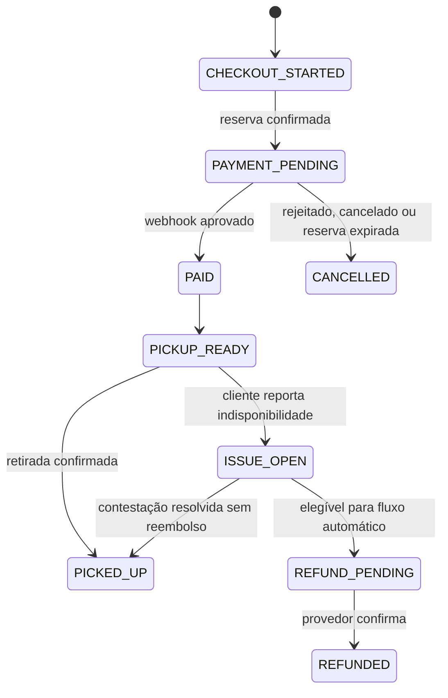

# CapiLoop — Proposta de Arquitetura para Regras de Negócio Críticas

> **Nota de compliance.** Esta proposta descreve separação técnica de valores e rastreabilidade operacional. Ela **não** determina enquadramento fiscal, responsabilidade tributária ou obrigação de emissão documental. Split de pagamento não substitui a validação com contador e assessoria jurídica locais antes da operação comercial.

## 1. Decisão de arquitetura

O CapiLoop deve ser um domínio separado da Treeway Forest. Embora ambos possam usar React, Node, tRPC e banco relacional, seus modelos, políticas de acesso e integrações de pagamento não devem compartilhar tabelas de negócio. A recomendação é tratar o CapiLoop como um serviço de marketplace com três fontes de verdade: banco transacional para estoque e pedidos, provedor de pagamento para a liquidação e reembolso, e uma trilha de eventos imutável para auditoria.

Para o modelo 1:1 do Mercado Pago, cada restaurante precisa autorizar a conexão por OAuth; a documentação também diferencia os campos de comissão para Checkout Pro (`marketplace_fee`) e Checkout API (`application_fee`).[1] [2] A comissão do marketplace é descontada do valor recebido pelo vendedor depois da comissão do próprio Mercado Pago, portanto o produto deve armazenar valor comercial, taxa de plataforma e valores liquidados como campos distintos — nunca inferir tributação a partir de um único `amount`.[2]

| Pilar | Fonte de verdade | Regra principal |
|---|---|---|
| Preço e divisão | `orders` + `payment_allocations` | Todo valor é armazenado em centavos inteiros, sem `float`. |
| Estoque | `bags` + `reservations` | A reserva reduz disponibilidade dentro de uma transação atômica. |
| Expiração | Consulta do feed + tarefa periódica | Nenhuma sacola com `pickup_end_at <= agora_UTC` pode ser comprada. |
| Pagamento | `payments` + `payment_events` | Webhook assinado é confirmado por consulta ao provedor antes de mudar estado. |
| Disputa e reembolso | `issues` + `refunds` + `merchant_score_events` | A punição ocorre em evento confirmado, não somente na denúncia inicial. |

## 2. Modelos de dados propostos

### 2.1. Restaurante e credenciais de marketplace

| Tabela | Campos essenciais | Observações |
|---|---|---|
| `restaurants` | `id`, `legal_name`, `status`, `reliability_score`, `created_at` | O score é derivado de eventos; não deve ser editado manualmente sem auditoria. |
| `restaurant_payment_connections` | `restaurant_id`, `provider`, `oauth_seller_id`, `access_token_encrypted`, `token_expires_at`, `status` | Tokens OAuth ficam cifrados no servidor; jamais são enviados ao cliente. |
| `restaurant_score_events` | `id`, `restaurant_id`, `order_id`, `type`, `weight`, `reason`, `created_at` | Exemplos: `confirmed_stockout`, `late_cancellation`, `successful_pickup`. |

### 2.2. Sacolas, janelas de retirada e estoque

| Tabela | Campos essenciais | Regra |
|---|---|---|
| `bags` | `id`, `restaurant_id`, `title`, `status`, `pickup_start_at`, `pickup_end_at`, `available_quantity`, `reserved_quantity`, `row_version` | Datas em UTC e `status` em `DRAFT`, `ACTIVE`, `PAUSED`, `SOLD_OUT`, `EXPIRED`. |
| `bag_price_snapshots` | `bag_id`, `currency`, `total_bag_value_cents`, `platform_commission_fee_cents`, `customer_charge_amount_cents`, `fee_bearer`, `valid_from` | Congela a regra comercial no momento da compra. |
| `reservations` | `id`, `bag_id`, `customer_id`, `order_id`, `status`, `expires_at`, `idempotency_key` | Estados: `HELD`, `CONFIRMED`, `RELEASED`, `EXPIRED`. |

**Campos monetários obrigatórios.** O pedido deve manter explicitamente `total_bag_value_cents`, que representa o valor comercial do alimento pertencente ao restaurante, e `platform_commission_fee_cents`, que representa a comissão do CapiLoop. Para relatórios e conciliação, inclua também `customer_charge_amount_cents`, `provider_fee_cents`, `restaurant_settlement_cents` e `currency`.

Isso resolve três ambiguidades recorrentes: o que o consumidor pagou, qual é a comissão da plataforma e quanto o restaurante efetivamente recebeu após taxas do provedor. Nenhum desses campos deve ser derivado em tempo real depois do pagamento aprovado; o snapshot do pedido deve ser imutável.

### 2.3. Pedido, pagamento, disputa e reembolso

| Tabela | Campos essenciais | Estados recomendados |
|---|---|---|
| `orders` | `id`, `public_code`, `customer_id`, `restaurant_id`, `bag_id`, snapshot de valores, `pickup_start_at`, `pickup_end_at`, `status` | `CHECKOUT_STARTED`, `PAYMENT_PENDING`, `PAID`, `PICKUP_READY`, `PICKED_UP`, `ISSUE_OPEN`, `REFUND_PENDING`, `REFUNDED`, `CANCELLED`. |
| `payments` | `order_id`, `provider`, `provider_payment_id`, `provider_order_id`, `status`, `idempotency_key`, `raw_status`, `approved_at` | `CREATED`, `PENDING`, `AUTHORIZED`, `APPROVED`, `REJECTED`, `CANCELLED`, `REFUNDED`. |
| `payment_events` | `provider_event_id`, `payment_id`, `payload_hash`, `signature_valid`, `received_at`, `processed_at` | `provider_event_id` único impede processamento duplo. |
| `issues` | `order_id`, `reported_by`, `type`, `description`, `evidence_url`, `status`, `reported_at` | `BAG_NOT_AVAILABLE`, `QUALITY`, `PICKUP_PROBLEM`; estados `OPEN`, `AUTO_REVIEW`, `RESOLVED`, `REJECTED`. |
| `refunds` | `order_id`, `payment_id`, `issue_id`, `amount_cents`, `status`, `provider_refund_id`, `idempotency_key` | `REQUESTED`, `SUBMITTED`, `SUCCEEDED`, `FAILED`, `MANUAL_REVIEW`. |

## 3. Checkout e split de pagamento

### 3.1. Regra de cálculo

O primeiro lançamento deve usar uma única política explícita: **comissão descontada do restaurante**. Nessa opção, o consumidor paga `customer_charge_amount_cents = total_bag_value_cents`, enquanto o CapiLoop recebe `platform_commission_fee_cents` por meio do split. O valor líquido do restaurante é calculado somente após a taxa do provedor e a comissão da plataforma serem conhecidas.

> Não use um campo genérico como `amount`, nem multiplique a comissão do CapiLoop por item no frontend. Todo cálculo deve acontecer no backend sobre o snapshot de preço do pedido.

No Checkout Pro, a documentação do Mercado Pago indica `marketplace_fee` na preferência; no Checkout API, o campo equivalente é `application_fee` na criação do pagamento.[2] O uso do token OAuth do restaurante e da comissão deve ocorrer somente no backend.[2]

```json
{
  "external_reference": "order_01J...",
  "items": [
    {
      "id": "bag_01J...",
      "title": "Sacola surpresa — restaurante parceiro",
      "quantity": 1,
      "currency_id": "BRL",
      "unit_price": 25.00
    }
  ],
  "marketplace_fee": 4.00,
  "notification_url": "https://api.capiloop.example/webhooks/mercado-pago",
  "metadata": {
    "order_id": "order_01J...",
    "reservation_id": "reservation_01J...",
    "price_snapshot_version": 1
  }
}
```

| Campo do payload | Origem interna | Proteção |
|---|---|---|
| `external_reference` | `orders.id` público | Único e imutável. |
| `items[].unit_price` | `customer_charge_amount_cents / 100` | Calculado no servidor. |
| `marketplace_fee` | `platform_commission_fee_cents / 100` | Calculado no servidor; nunca aceito do cliente. |
| `notification_url` | Configuração do ambiente | HTTPS e assinatura validada. |
| Token do vendedor | `restaurant_payment_connections` | Cifrado, acessível apenas no backend. |

## 4. Expiração inteligente

### Estratégia recomendada: consulta em tempo real + consolidação periódica

A remoção da home não pode depender exclusivamente de uma tarefa em segundo plano. A consulta do feed deve sempre aplicar `pickup_end_at > NOW_UTC()` e `status = 'ACTIVE'`; assim, a sacola some no minuto em que vence, mesmo se a tarefa de manutenção atrasar. Uma tarefa periódica complementar consolida o estado em `EXPIRED`, libera reservas vencidas e produz métricas.

| Abordagem | Resultado | Custo operacional | Complexidade |
|---|---|---:|---:|
| Somente consulta no feed | Some da home imediatamente, mas deixa estados antigos no banco | Baixo | Baixa |
| Somente tarefa periódica | Pode mostrar item vencido entre execuções | Baixo | Média |
| **Consulta no feed + tarefa periódica** | Remove imediatamente, mantém estados e métricas consistentes | Baixo | Média |

O job determinístico deve rodar a cada minuto, em ambiente de aplicação com agenda de execução, e executar em lotes idempotentes. Ele não precisa de IA, polling externo ou processo sempre ativo. A lógica é:

```sql
UPDATE bags
SET status = 'EXPIRED', updated_at = NOW(6)
WHERE status IN ('ACTIVE', 'PAUSED')
  AND pickup_end_at <= NOW(6);

UPDATE reservations
SET status = 'EXPIRED'
WHERE status = 'HELD'
  AND expires_at <= NOW(6);
```

No frontend, o contador visual pode usar `server_now` recebido com o feed para evitar distorções do relógio local. Esse contador é apenas apresentação; o servidor sempre decide se a sacola pode ser reservada ou paga.

## 5. Proteção contra estoque esgotado

### Reserva antes do pagamento

Quando o usuário inicia checkout, o backend cria uma `reservation` com vida curta — por exemplo, 10 minutos — dentro da mesma transação que reduz a disponibilidade. O frontend não recebe permissão para decrementar estoque diretamente.

```sql
UPDATE bags
SET available_quantity = available_quantity - 1,
    reserved_quantity = reserved_quantity + 1,
    row_version = row_version + 1
WHERE id = :bag_id
  AND status = 'ACTIVE'
  AND pickup_end_at > NOW(6)
  AND available_quantity > 0
  AND row_version = :expected_version;
```

Se o update não afetar uma linha, o checkout recebe `BAG_UNAVAILABLE` e o cliente é levado de volta ao feed atualizado. A mesma chave de idempotência é usada para `createReservation`, `createPayment` e `refund`; uma repetição de rede retorna a mesma reserva ou pagamento, sem duplicar estoque ou cobrança.

### Máquina de estados do pedido



## 6. Fluxo de indisponibilidade e disputa

No recibo digital, o usuário deve visualizar cronologia do pedido, janela de retirada, código do pedido e ação secundária **“Reportar problema”**. Ao selecionar **“Sacola indisponível”**, abre-se um diálogo curto com confirmação, descrição opcional e evidência opcional. O relatório deve ficar visível no pedido imediatamente, evitando que o usuário repita a solicitação.

| Etapa | Ação do sistema | Controle de risco |
|---|---|---|
| 1. Cliente reporta | Cria `issues` com tipo `BAG_NOT_AVAILABLE`; pedido vira `ISSUE_OPEN`. | Limite: um relato aberto por pedido. |
| 2. Elegibilidade | Confere pedido pago, ainda não retirado e dentro da janela de retirada. | Fora dessas condições, envia para revisão manual. |
| 3. Reembolso | Cria `refunds` com chave de idempotência; chama provedor uma vez. | Ação repetida apenas consulta o mesmo reembolso. |
| 4. Confirmação | Webhook/consulta do provedor confirma `REFUNDED`. | Não marque o pedido como reembolsado só pela resposta inicial. |
| 5. Score do restaurante | Cria `restaurant_score_events` com penalidade por indisponibilidade confirmada. | Não penalize pela denúncia sem confirmação. |
| 6. Contestação | Restaurante pode anexar contexto; casos fora da regra automática permanecem em revisão. | Trilha de auditoria preserva decisão e evidências. |

O Mercado Pago diferencia cancelamento de pagamento ainda não aprovado e reembolso de pagamento aprovado; para reembolso total ou parcial, a API de Orders documenta ação específica e destaca que há janela de reembolso e necessidade de saldo disponível.[4] Por isso, o CapiLoop deve modelar `refund_requested` e `refund_succeeded` como eventos separados.

## 7. Webhooks, conciliação e idempotência

O webhook não deve atualizar o pedido diretamente com base apenas no corpo recebido. O receptor deve validar `x-signature`, registrar o evento bruto com hash, responder rapidamente e consultar o pagamento no provedor antes de aplicar a transição. A documentação informa que webhooks podem ser configurados por integração ou preferência, usam HTTPS, incluem assinatura e são reenviados caso o servidor não confirme a recepção.[3]

```text
Webhook recebido
  → validar assinatura e timestamp
  → inserir payment_event único
  → responder 200 rapidamente
  → worker consulta pagamento pelo provider_payment_id
  → aplica transição de estado permitida
  → publica atualização do pedido / invalida cache do cliente
```

Para cartão com pré-autorização, reserva financeira e captura não substituem a reserva de estoque. A captura depende de fluxo específico do provedor e possui limite documentado de tempo; ela deve ser adotada apenas depois de validar disponibilidade regional, meios de pagamento e produto comercial.[5]

## 8. Estado no cliente e estruturas de componentes

O cliente deve manter apenas estado efêmero de interface; disponibilidade, valor e status vêm do servidor por consulta invalidável.

| Componente | Estado local permitido | Dados do servidor |
|---|---|---|
| `BagCard` | `isCheckoutOpening` | Disponibilidade, janela, status, preço público. |
| `CheckoutSheet` | `reservationId`, `reservationExpiresAt`, `isSubmitting` | Snapshot do pedido e URL/token do checkout. |
| `OrderReceipt` | `issueDialogOpen`, `draftIssueMessage` | Linha do tempo do pedido, pagamento e reembolso. |
| `ReportIssueDialog` | Tipo do problema, texto e anexo em preparação | Elegibilidade e histórico de relatos. |
| `MerchantBagManager` | Rascunho de edição | Estoque, horário, score e pedidos vinculados. |

Use cache de consultas com invalidação após `reservation.create`, `payment.status`, `issue.create` e eventos do provedor. Não faça atualização otimista de estoque como fonte de verdade: no máximo mostre um estado “reservando” até a confirmação do backend.

## 9. Ordem de implementação

1. Criar modelos e migrações de restaurantes, conexões OAuth, sacolas, snapshots, reservas, pedidos, pagamentos, eventos e disputas.
2. Implementar feed com filtro temporal no SQL e reserva transacional com chave de idempotência.
3. Implementar Checkout Pro primeiro, usando OAuth do restaurante, `external_reference`, `marketplace_fee` e webhook assinado.
4. Implementar recibo digital, ação de indisponibilidade e motor de reembolso com trilha de auditoria.
5. Adicionar job de consolidação de expiração, liberação de reservas e conciliação diária.
6. Validar em contas de teste e com o time comercial do Mercado Pago antes de liberar cobrança real, especialmente para disponibilidade do modelo de split, regras de comissão e cronograma de repasse.

## Referências

[1]: https://www.mercadopago.com.br/developers/en/docs/split-payments/split-1-1/overview "Mercado Pago — Split Payments 1:1"
[2]: https://www.mercadopago.com.ar/developers/en/docs/checkout-pro/how-tos/integrate-marketplace "Mercado Pago — How to integrate checkout in marketplace"
[3]: https://www.mercadopago.com.br/developers/en/docs/checkout-pro/payment-notifications "Mercado Pago — Configure payment notifications"
[4]: https://www.mercadopago.com.mx/developers/en/docs/checkout-api-orders/refunds-cancellations "Mercado Pago — Refunds and cancellations"
[5]: https://www.mercadopago.com.mx/developers/en/docs/checkout-bricks/additional-content/payment-management/capture-authorized-payment "Mercado Pago — Capture authorized payment"
